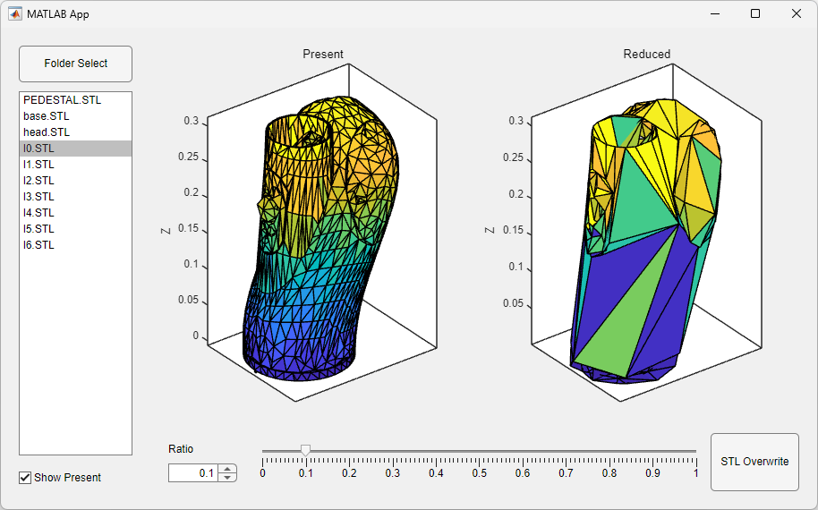
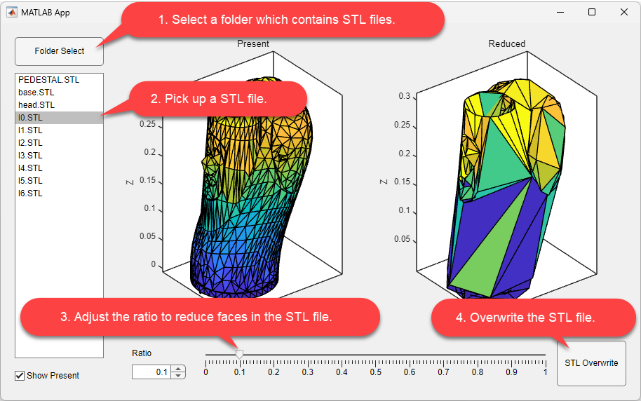

# STL Resolution Reducer 

The STL Resolution Reducer streamlines the process of decreasing the number of faces in STL files, enabling smoother animations for highly precise 3D mechanical simulation models, such as Simscape&trade; Multibody&trade;. This essential tool aids in visual verification and seeks to optimize the balance between simulation speed and rendering accuracy.

## Setup 
To set up STL Resolution Reducer, you have two options:
1. Run the `StlResolutionReducer.mlapp` directly in MATLAB.
2. Install the `StlResolutionReducer.mlappinstall` file.

### MathWorks Products (https://www.mathworks.com)
Requires MATLAB&reg; release R2024a or newer
- [MATLAB&reg;](https://www.mathworks.com/products/matlab.html)

### 3rd Party Products:
No third-party products required.

## Getting Started
You can get started easily with the following four steps:
1. Select a folder which contains STL files.
2. Pick up a STL file.
3. Adjust the ratio to reduce faces in the STL file.
4. Overwrite the STL file.
   

## License
The license is available in the License.txt file in this GitHub repository.

## Community Support
For questions and support, please visit [MATLAB Central](https://www.mathworks.com/matlabcentral)

Copyright 2024 The MathWorks, Inc.
